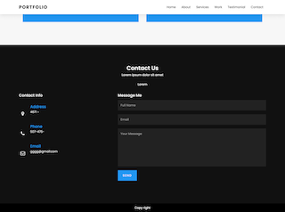
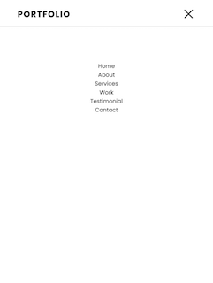

# Source
https://www.youtube.com/watch?v=UnlXPMKB-wE&list=WL&index=2&t=174s

# What I Learned

## CSS
1. scroll behavior
    ```css
    scroll-behavior: smooth;
    ```
1. filter
    ```css
    filter: invert(1);
    ```
1. menu effect
    ```css
    .menu {
      left: -100%;
    }
    .menu.active {
      left: 0;
    }
    ```
1. style of input and textarea
    ```css
    .formBx form input,
    .formBx form textarea {
      margin-bottom: 20px;
      padding: 15px;
      font-size: 16px;
      background: transparent;
      border: none;
      outline: none;
      background: #222;
      color: #fff;
      resize: none;
    }
    .formBx form textarea {
      min-height: 200px;
    }
    .formBx form input::placeholder,
    .formBx form textarea::placeholder {
      color: #999;
    }
    ```

## Javascript
```javascript
window.addEventListener('scroll', function() {
  var header = document.querySelector('header');
  header.classList.toggle('sticky', window.scrollY > 0);
});
```

# Results




